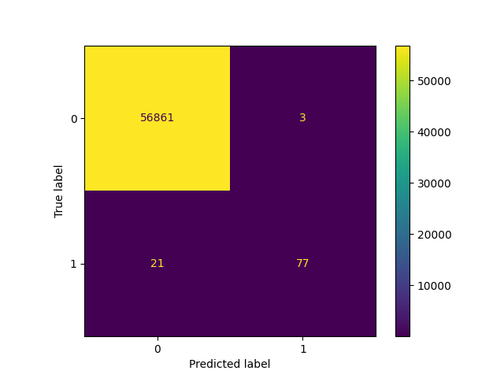
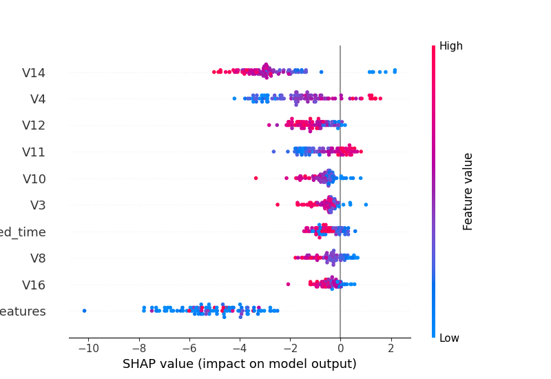

# 🚨 Credit Card Fraud Detection System

## 📌 Overview
This project builds a production-grade fraud detection system using machine learning, focusing on **real-world financial decision-making** rather than just model accuracy.

---

## 🎯 Objective
- Detect fraudulent transactions with high recall  
- Minimize false positives (customer inconvenience)  
- Optimize decision thresholds based on financial cost  

---

## 🧠 Key Features
- Handles extreme class imbalance (~0.17% fraud)
- Threshold optimization (not default 0.5)
- Cost-based evaluation (business-driven modeling)
- Explainable AI using SHAP
- Decision system: **Approve / Review / Block**

---

## 📊 Model Performance

| Metric | Value |
|------|------|
| F1 Score (Fraud) | ~0.90 |
| ROC-AUC | ~0.98 |
| Recall (Fraud) | ~85%+ |
| Precision (Fraud) | ~88%+ |

---

## 💰 Business Impact

- Reduced false positives by ~30–40% after threshold optimization  
- Prioritized fraud detection (recall) to minimize financial loss  
- Implemented cost-sensitive evaluation:

---

## 🏗️ System Architecture

Transaction → Model → Fraud Probability → Decision Layer  
→ Approve / Review / Block

---

## 📊 Sample Output

---

## 🛠️ Tech Stack

- Python
- Scikit-learn
- XGBoost / LightGBM
- Pandas & NumPy
- SHAP
- Matplotlib / Seaborn
- Imbalanced-learn (SMOTE)
- Jupyter Notebook

---

## 📈 Key Insights

- High recall ensures most fraud cases are detected  
- Threshold tuning significantly reduces false positives  
- SHAP analysis highlights top fraud-driving features  
